# 📘 酒店库存管理系统 - 用户使用手册

欢迎使用酒店库存管理系统 (v2.7)。本系统旨在帮助您轻松管理仓库库存、追踪物资流向，并提供智能化的数据分析。

---

## 目录

1. [快速开始](#1-快速开始)
2. [界面概览](#2-界面概览)
3. [核心操作指南](#3-核心操作指南)
   - [入库登记 (进货)](#31-入库登记-进货)
   - [出库登记 (领用)](#32-出库登记-领用)
   - [查询与管理库存](#33-查询与管理库存)
4. [数据报表与审计](#4-数据报表与审计)
   - [出入库记录与批量撤销](#41-出入库记录与批量撤销)
   - [数据导出](#42-数据导出)
5. [系统配置 (管理员)](#5-系统配置-管理员)
   - [Excel 批量导入 (智能合并)](#51-excel-批量导入-智能合并)
   - [用户与权限](#52-用户与权限)
   - [分类与位置](#53-分类与位置)
6. [常见问题](#6-常见问题)

---

## 1. 快速开始

### 登录系统
打开网站链接，您将看到登录界面。

*   **默认管理员账号**: `admin`
*   **默认密码**: `123456`
*   **提示**: 首次登录后，请务必在“系统配置”中修改密码以确保安全。

> **✨ 免登录功能**: 系统会自动记住您的登录状态 30 分钟。在此期间刷新页面无需重新输入密码。

---

## 2. 界面概览

登录后，左侧为导航菜单，右侧为操作区域。

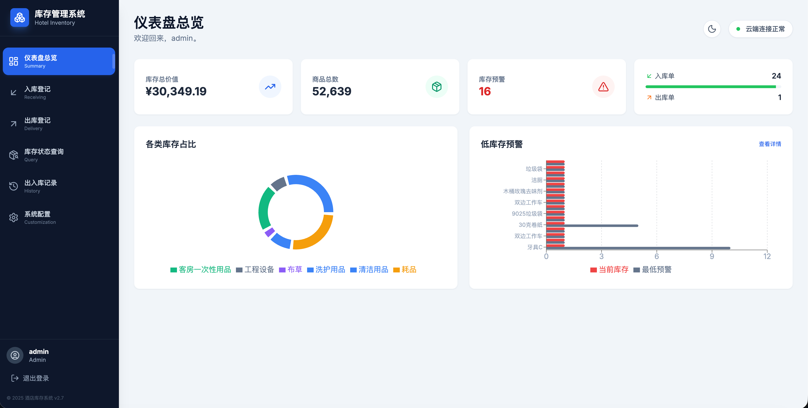

*   **🌙 深色模式**: 点击右上角的“月亮/太阳”图标，一键切换护眼深色模式。
*   **📊 仪表盘**: 
    *   **库存概览**: 显示总价值、商品总数。
    *   **🔴 预警跳转**: 点击红色的“库存预警”卡片，可直接跳转到缺货商品清单。
    *   **📉 记录跳转**: 点击“入库单/出库单”统计卡片，可直接跳转到历史记录页面。

---

## 3. 核心操作指南

### 3.1 入库登记 (进货)
当有新货品到达仓库时，请使用此功能。

1. 点击左侧菜单 **“入库登记”**。

2.  **搜索或添加商品**: 
    
    * 在输入框打字（如“洗发水”），系统会自动筛选现有商品。
    
      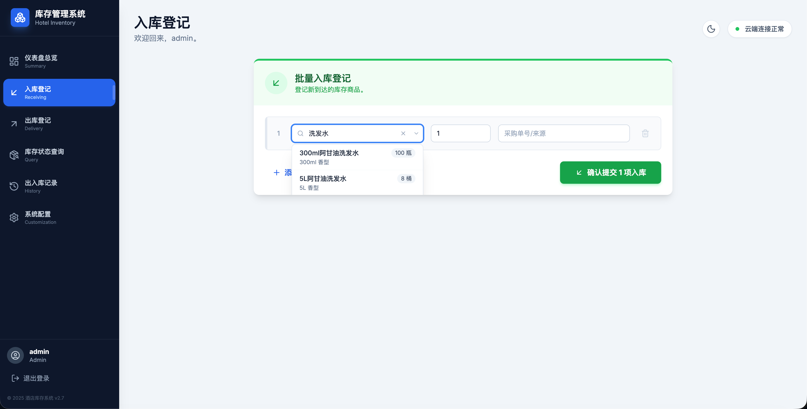
    
    * **🆕 快捷添加新商品**: 如果搜不到（是新品种），下拉框底部会出现 **“添加新商品: [xxx]”** 的按钮。
    
      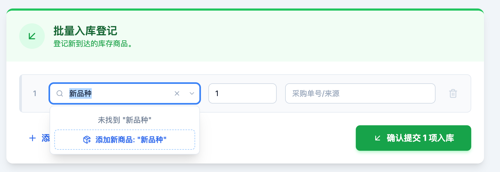
    
    * 点击后弹出窗口，填入单价、分类等信息（支持直接新建分类）。
    
      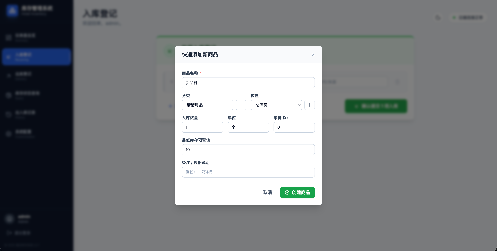
    
    * 点击 **“创建商品”** 后，系统会自动创建档案，并将商品名称填回入库单，无需重新搜索。
    
      
    
3. **填写数量**: 输入本次进货的数量。

4. **批量操作**: 如果有多项商品，点击 **“+ 添加一行”** 继续录入。

5.  确认无误后，点击底部绿色的 **“确认提交入库”** 按钮。

### 3.2 出库登记 (领用)
当员工从仓库领取物品时，请使用此功能。

1. 点击左侧菜单 **“出库登记”**。

   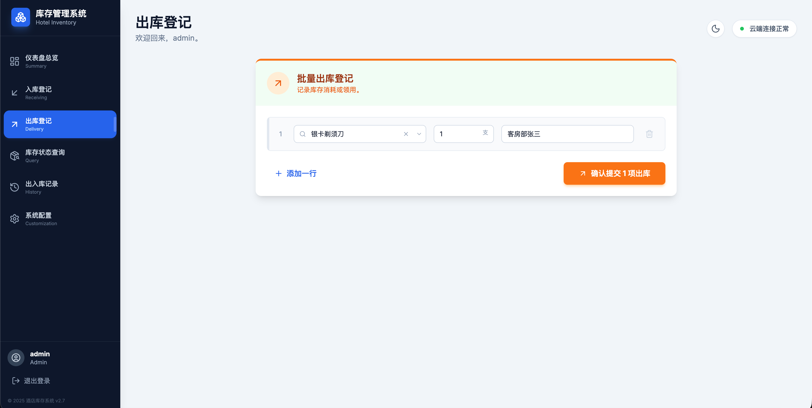

2. **选择商品**: 搜索要领用的商品。
   *   *注意：系统会显示当前库存。如果库存不足，将无法提交。*

3. **填写数量**: 输入领用数量。

4. **填写备注**: 建议填写“领用人姓名”或“用途”（如：客房部张三）。

5. 点击橙色的 **“确认提交出库”** 按钮。

### 3.3 查询与管理库存
查看仓库内所有物品的实时状态。

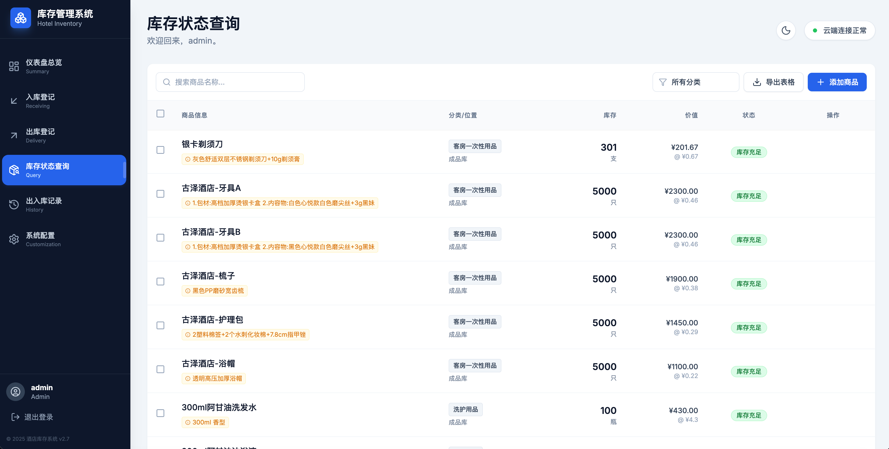

1. 点击左侧菜单 **“库存状态查询”**。

2. **搜索与筛选**: 支持按名称搜索、按分类筛选。

3. **编辑/删除**:

   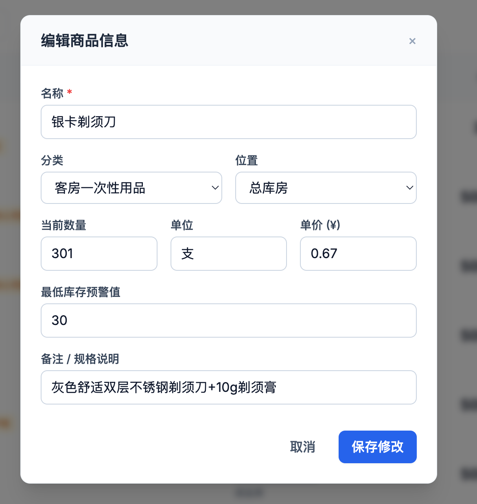

   *   点击 ✏️ 修改商品信息（如预警值、单价）。
   *   点击 🗑️ 删除单个商品。

4. **🗑️ 批量删除**:
   *   勾选表格左侧的复选框（或全选）。
   *   点击顶部出现的 **“批量删除”** 按钮，可一次性清理多项废弃商品。

5. **手动新增**: 点击右上角 **“+ 添加商品”**。

   *   *提示：如果在此处设置了初始数量 > 0，系统会自动生成一条“初始库存录入”的历史记录。*

---

## 4. 数据报表与审计

### 4.1 出入库记录与批量撤销
每一笔操作都会被永久记录，支持追溯和回滚。

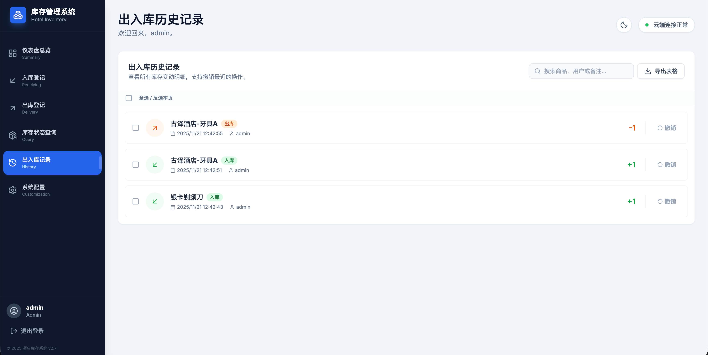

1. 点击左侧菜单 **“出入库记录”**。

2. **⏪ 单条撤销**: 发现录错时，点击右侧 **“撤销”** 按钮。系统会自动删除记录并**回滚库存**（如：撤销入库=扣减库存），无需人工计算。

3. **✨ 批量撤销**: 

   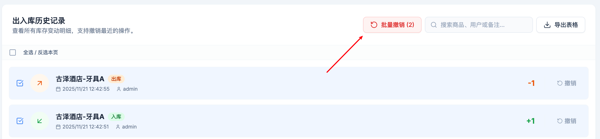

   *   如果一次性录错了多条（例如整个入库单都填错了），勾选这些记录。
   *   点击顶部的 **“批量撤销”** 按钮，系统会智能计算所有选中的记录并一次性回滚。

### 4.2 数据导出
支持导出标准的 Excel (`.xlsx`) 文件，方便财务对账或打印。
*   **库存清单**: 在“库存状态查询”页面点击“导出表格”。
*   **流水明细**: 在“出入库记录”页面点击“导出表格”。

---

## 5. 系统配置 (管理员)

此页面仅 **管理员 (Admin)** 可见。

### 5.1 Excel 批量导入 (智能合并)
不再需要手动一条条录入，支持 Excel 一键导入。

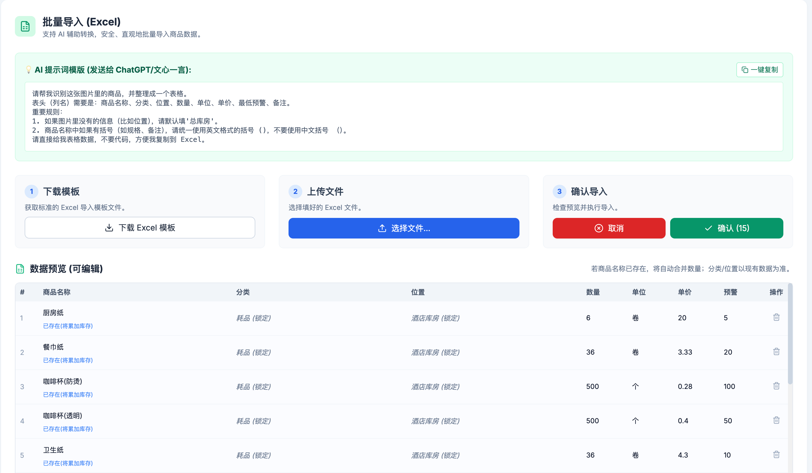

1.  **下载模板**: 点击 **“下载 Excel 模板”** 获取标准格式。
2.  **填写数据**:
    *   **人工填写**: 直接在 Excel 中编辑。
    *   **🤖 AI 辅助**: 拍照进货单发给 AI (ChatGPT/文心一言)，使用页面上的 **“AI 提示词”** 让它生成表格数据，然后复制到 Excel。
3.  **上传预览**: 选择文件后，系统会解析并展示预览表格。
    *   **可编辑**: 您可以在预览界面直接修改错别字或调整数量，也可以删除不需要的行。
4.  **确认导入**: 点击确认。
    *   **智能合并**: 如果商品名已存在，系统会**自动保留**原有的分类/位置信息，只**累加库存数量**。
    *   **自动记录**: 系统会为导入的每一笔数量自动生成入库记录。

### 5.2 用户与权限

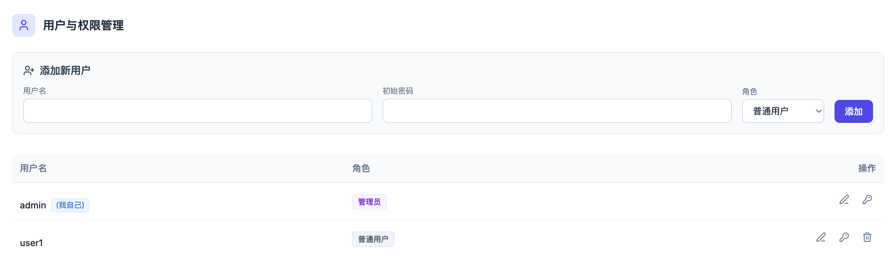

*   **添加用户**: 为员工创建账号，分配 **管理员** 或 **普通用户** 角色。
*   **管理**: 修改用户名、重置密码或删除离职员工账号。

### 5.3 分类与位置

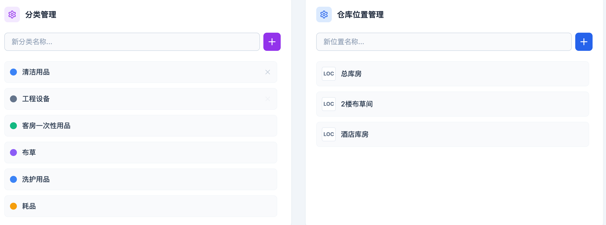

*   预设商品的分类（如：布草、耗材）和仓库位置。
*   *提示：在“入库登记”的快捷添加窗口中，也可以直接创建新分类和位置。*

---

## 6. 常见问题

**Q: 我刚才新建了商品，为什么入库单里没显示名字？**
A: 系统已优化此功能。现在创建商品后，名称会自动回填到输入框中。如果偶尔遇到网络延迟，重新点击一下搜索框即可。

**Q: 导入 Excel 时，商品名字一样但分类填错了怎么办？**
A: 放心，系统以**数据库现有数据为准**。只要商品名称匹配（例如都叫“洗手液”），系统会忽略 Excel 里的分类/位置，直接沿用您系统中设置好的分类，只增加库存数量。

**Q: 为什么普通用户看不到“系统配置”？**
A: 为了数据安全，只有管理员可以访问配置页面（包括导入数据、删除用户等高风险操作）。

**Q: “库存归零”是什么？**
A: 这是一个危险操作（位于系统配置底部）。它会把所有商品的库存变成 0，并清空所有历史记录，但保留商品名称和资料。通常用于年度大盘点重新开账。